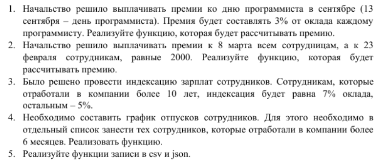
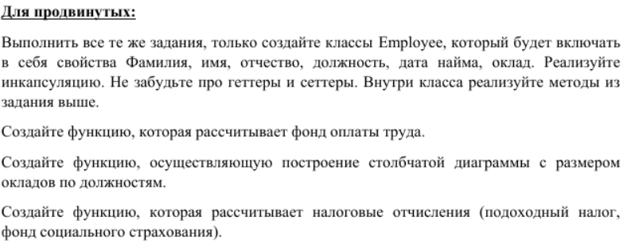

# Помощник начальника
## Задание (основное)

## Функциональные требования
1. Расчёт премии в день программиста (13 сентября, 3% от оклада каждому программисту)
2. Премия в размере 2000 на 8 марта и 23 февраля
3. Индексация (10+ лет в компании - 7%, иначе - 5%)
4. Список сотрудников, отработавших 6+ месяцев
5. Функция записи в csv и json файлы

## Функциональные требования (продвинутая часть)
1. Создать класс Employee. Требования: 
    1. Свойства:
        - Фамилия
        - Имя
        - Отчество
        - Должность
        - Дата найма
        - Оклад
    2. Инкапсуляция:
        - Геттеры
        - Сеттеры
    3. Реализовать методы, описанные выше, внутри класса
2. Функция, рассчитывающая фонд оплаты труда
3. Функция, строящая столбчатые диаграммы с размером окладов по должностям
4. Функция, которая расчитывает налоговые отчисления:
    - Подоходный налог
    - Фонд социального страхования

